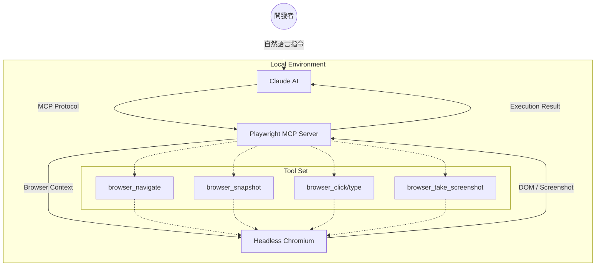

# 🎭 Playwright MCP 自動化測試

### AI 驅動的次世代瀏覽器自動化方案

<div class="pt-12">
  <span @click="$slidev.nav.next" class="px-4 py-2 rounded border border-white/20 hover:bg-white/10 cursor-pointer transition">
    開始探索 <carbon:arrow-right class="inline ml-1"/>
  </span>
</div>

<div class="abs-br m-6 flex gap-2">
  <span class="text-sm opacity-60 font-mono">2026-01-15 | Automation 2.0</span>
</div>

---
transition: fade-out
layout: default
---

# 📋 課程導航

<div class="grid grid-cols-2 gap-8 mt-10">

<div class="space-y-4">
  <v-click>
    <div class="flex items-center gap-3 text-xl">
      <div class="w-8 h-8 rounded bg-blue-500/20 flex items-center justify-center text-blue-400">1</div>
      <span><strong>核心概念</strong>：什麼是 Playwright MCP？</span>
    </div>
  </v-click>
  <v-click>
    <div class="flex items-center gap-3 text-xl">
      <div class="w-8 h-8 rounded bg-green-500/20 flex items-center justify-center text-green-400">2</div>
      <span><strong>工具箱</strong>：6 個關鍵指令解析</span>
    </div>
  </v-click>
  <v-click>
    <div class="flex items-center gap-3 text-xl">
      <div class="w-8 h-8 rounded bg-purple-500/20 flex items-center justify-center text-purple-400">3</div>
      <span><strong>實戰演示</strong>：Dashboard 測試流程</span>
    </div>
  </v-click>
</div>

<div class="space-y-4">
  <v-click>
    <div class="flex items-center gap-3 text-xl">
      <div class="w-8 h-8 rounded bg-orange-500/20 flex items-center justify-center text-orange-400">4</div>
      <span><strong>案例分析</strong>：Bug 發現與閉環修復</span>
    </div>
  </v-click>
  <v-click>
    <div class="flex items-center gap-3 text-xl">
      <div class="w-8 h-8 rounded bg-teal-500/20 flex items-center justify-center text-teal-400">5</div>
      <span><strong>最佳實踐</strong>：專家級測試心法</span>
    </div>
  </v-click>
</div>

</div>

---
layout: section
---

# Part 1
## 為什麼我們需要 MCP 測試？
### 突破傳統自動化測試的瓶頸

---
layout: default
---

# 🤔 傳統 UI 測試的痛點

<div class="grid grid-cols-2 gap-12 mt-8">

<div class="space-y-6">
  <div class="flex items-start gap-4" v-click>
    <div class="text-3xl">🧩</div>
    <div>
      <h3 class="text-xl font-bold text-red-400">維護成本高昂</h3>
      <p class="opacity-80 text-sm">DOM 結構一變，腳本就掛；Selector 維護是場惡夢。</p>
    </div>
  </div>

  <div class="flex items-start gap-4" v-click>
    <div class="text-3xl">🤖</div>
    <div>
      <h3 class="text-xl font-bold text-red-400">缺乏語義理解</h3>
      <p class="opacity-80 text-sm">腳本不懂「登入」是什麼，它只知道點擊 <code>#btn-login</code>。</p>
    </div>
  </div>
</div>

<div class="space-y-6">
  <div class="flex items-start gap-4" v-click>
    <div class="text-3xl">⏱️</div>
    <div>
      <h3 class="text-xl font-bold text-red-400">交互效率低</h3>
      <p class="opacity-80 text-sm">撰寫完整的測試腳本需要大量時間，無法跟上快速迭代。</p>
    </div>
  </div>

  <div class="flex items-start gap-4" v-click>
    <div class="text-3xl">📉</div>
    <div>
      <h3 class="text-xl font-bold text-red-400">驗證盲點</h3>
      <p class="opacity-80 text-sm">通常只檢查特定數值，容易忽略頁面上的其他視覺錯誤。</p>
    </div>
  </div>
</div>

</div>

---

# 💡 Paradigm Shift：從「腳本」到「意圖」

<div class="grid grid-cols-2 gap-8 mt-8">

<div class="bg-gray-800/30 p-6 rounded-xl border border-gray-700">
  <h3 class="text-center mb-4 font-bold text-gray-400">傳統自動化 (Imperative)</h3>
  <div class="font-mono text-sm bg-black/40 p-4 rounded text-gray-300">
    <span class="text-green-400">driver</span>.find_element(By.ID, <span class="text-yellow-300">"username"</span>).send_keys(<span class="text-yellow-300">"user"</span>)<br>
    <span class="text-green-400">driver</span>.find_element(By.ID, <span class="text-yellow-300">"submit"</span>).click()<br>
    <span class="text-blue-400">assert</span> "Dashboard" in <span class="text-green-400">driver</span>.title
  </div>
  <p class="mt-4 text-center text-sm opacity-70">"告訴電腦<b>每一步怎麼做</b>"</p>
</div>

<div class="bg-blue-900/20 p-6 rounded-xl border border-blue-500/30">
  <h3 class="text-center mb-4 font-bold text-blue-400">MCP + AI (Declarative)</h3>
  <div class="font-mono text-sm bg-black/40 p-4 rounded text-blue-200">
    <span class="text-purple-400">User</span>: "幫我登入並檢查 Dashboard 狀態"<br>
    <span class="text-green-400">AI</span>: (自主調用 browser_click, browser_snapshot)<br>
    <span class="text-green-400">AI</span>: "已登入，目前系統狀態顯示正常"
  </div>
  <p class="mt-4 text-center text-sm opacity-70">"告訴 AI <b>你想要什麼結果</b>"</p>
</div>

</div>

<div class="mt-8 text-center text-sm opacity-60">
  Model Context Protocol (MCP) 是一個標準化協議，讓 AI 模型能夠安全地與本地工具（如瀏覽器）進行交互。
</div>

---

# 🏗️ 系統架構圖



---
layout: section
---

# Part 2
## 核心工具箱
### 掌握與瀏覽器溝通的語言

---

# 🧭 導航與感知：看見頁面

<div class="grid grid-cols-2 gap-8">

<div>

### 1. browser_navigate
**啟動與跳轉**

```json
{
  "tool": "browser_navigate",
  "url": "http://localhost:3003"
}
```
<ul class="text-sm opacity-80 mt-2 list-disc pl-4">
  <li>測試的起點</li>
  <li>相當於在網址列輸入 URL</li>
  <li>會自動等待頁面載入完成 (Network Idle)</li>
</ul>

</div>

<div>

### 2. browser_snapshot (⭐️核心)
**獲取 AI 可讀的 DOM 結構**

```yaml
- main:
    - heading "專案列表" [level=1]
    - radiogroup:
      - radio "Docker 管理" [ref=e78] 👈 重要!
      - radio "系統設定" [ref=e92]
    - button "新增專案" [ref=e105]
```
<ul class="text-sm opacity-80 mt-2 list-disc pl-4">
  <li>將複雜的 HTML 轉換為簡潔的 YAML</li>
  <li>分配唯一的 **ref ID** (如 <code>e78</code>)</li>
  <li>AI 依賴此結構來理解頁面並進行操作</li>
</ul>

</div>

</div>

---

# 👆 操作與存證：執行動作

<div class="grid grid-cols-2 gap-8">

<div>

### 3. browser_click
**精確交互**

```json
{
  "tool": "browser_click",
  "element": "Docker 管理 radio button",
  "ref": "e78"
}
```

<div class="bg-yellow-500/10 border-l-4 border-yellow-500 p-2 mt-2 text-xs">
  ⚠️ <strong>Critical:</strong> 必須先執行 <code>snapshot</code> 獲取最新的 <code>ref</code> ID，禁止憑記憶或猜測 ID。
</div>

</div>

<div>

### 4. browser_take_screenshot
**視覺證據**

```json
{
  "tool": "browser_take_screenshot",
  "filename": "docker-test-result.png"
}
```

<ul class="text-sm opacity-80 mt-2 list-disc pl-4">
  <li>用於保存測試結果</li>
  <li>作為 Bug report 的佐證</li>
  <li>AI 可以通過截圖進行簡單的視覺驗證</li>
</ul>

</div>

</div>

---
layout: section
---

# Part 3
## 實戰演示
### 測試 Dev Orchestrator Dashboard

---
layout: two-cols
---

# 🎯 測試目標
**Dev Orchestrator Dashboard**

我們將模擬一個完整的測試流程，驗證系統的關鍵功能。

### 測試計畫 (Test Plan)

<v-clicks>

1. **Smoke Test**: 驗證首頁載入與標題
2. **Navigation**: 切換至 Docker 管理頁面
3. **Data Verification**: 驗證容器數量與狀態
4. **Evidence**: 截圖保存測試結果

</v-clicks>

::right::

<div class="p-4 bg-gray-800/50 rounded-lg border border-gray-700 h-64 flex items-center justify-center">
  <div class="text-center">
    <div class="text-4xl mb-2">🖥️</div>
    <div class="text-sm opacity-80">目標應用程式介面</div>
    <div class="text-xs opacity-50 mt-1">Dashboard 專案列表畫面</div>
  </div>
</div>

---

# Step 1 & 2: 導航與感知

<div class="grid grid-cols-2 gap-4">

<div>
  <div class="font-mono text-xs mb-1 text-green-400">User Command</div>
  <div class="bg-gray-800 p-2 rounded text-sm mb-4">"前往 localhost:3003 並告訴我你看到什麼"</div>

  <div class="font-mono text-xs mb-1 text-blue-400">Tool Execution</div>
  <div class="bg-black/50 p-2 rounded text-xs font-mono">
    > browser_navigate(url="...")<br>
    > browser_snapshot()
  </div>
</div>

<div class="bg-gray-900 p-3 rounded text-xs font-mono text-gray-300 h-60 overflow-y-auto">
  <span class="text-purple-400">snapshot output:</span><br>
  - generic [ref=e1]:<br>
  &nbsp;&nbsp;- banner:<br>
  &nbsp;&nbsp;&nbsp;&nbsp;- heading "Dev Orchestrator" [level=1]<br>
  &nbsp;&nbsp;- main:<br>
  &nbsp;&nbsp;&nbsp;&nbsp;- radiogroup "導航":<br>
  &nbsp;&nbsp;&nbsp;&nbsp;&nbsp;&nbsp;- radio "專案列表" [checked] [ref=e45]<br>
  &nbsp;&nbsp;&nbsp;&nbsp;&nbsp;&nbsp;- radio "Docker 管理" [ref=e78]<br>
  &nbsp;&nbsp;&nbsp;&nbsp;&nbsp;&nbsp;- radio "系統狀態" [ref=e102]<br>
  ...
</div>

</div>

<div class="mt-4 flex gap-4 items-center bg-blue-900/20 p-3 rounded border border-blue-500/30">
  <div class="text-2xl">🤖</div>
  <div class="text-sm">
    <strong>AI 解析：</strong> "我看到了導航選單，其中 <code>Docker 管理</code> 的 ref ID 是 <code>e78</code>，我將點擊它。"
  </div>
</div>

---

# Step 3: 執行操作與驗證

<div class="grid grid-cols-2 gap-8">

<div>
  <h3 class="text-lg mb-2">動作：點擊 Docker 管理</h3>
  <div class="bg-black/50 p-2 rounded text-xs font-mono mb-4">
    > browser_click(ref="e78")
  </div>

  <h3 class="text-lg mb-2">驗證：數據檢查</h3>
  <div class="text-sm">
    AI 再次調用 <code>snapshot</code>，並比對 DOM 中的數值：
  </div>

  <table class="mt-2 w-full text-sm border-collapse">
    <tr class="border-b border-gray-700">
      <th class="text-left py-1">檢查項目</th>
      <th class="text-left py-1">預期</th>
      <th class="text-left py-1">實際(DOM)</th>
      <th class="text-center py-1">狀態</th>
    </tr>
    <tr class="border-b border-gray-700/50">
      <td class="py-1">Docker Ver</td>
      <td class="py-1">28.0.1</td>
      <td class="py-1">28.0.1</td>
      <td class="text-center text-green-400">✅</td>
    </tr>
    <tr class="border-b border-gray-700/50">
      <td class="py-1">Status</td>
      <td class="py-1">Running</td>
      <td class="py-1">Running</td>
      <td class="text-center text-green-400">✅</td>
    </tr>
    <tr>
      <td class="py-1">Container #</td>
      <td class="py-1">3</td>
      <td class="py-1">3</td>
      <td class="text-center text-green-400">✅</td>
    </tr>
  </table>
</div>

<div class="relative bg-gray-800/50 rounded-lg border border-gray-600 h-40 flex items-center justify-center">
  <div class="text-center">
    <div class="text-3xl mb-1">🐳</div>
    <div class="text-sm opacity-80">Docker 管理介面</div>
  </div>
  <div class="absolute bottom-2 right-2 bg-black/70 px-2 py-1 rounded text-xs">browser_take_screenshot</div>
</div>

</div>

---
layout: section
---

# Part 4
## 案例分析：Bug 獵人
### 當 AI 發現數據異常時...

---

# 🚨 異常發現 (Bug Report)

在一次回歸測試中，AI 回報了以下數據不一致：

<div class="grid grid-cols-2 gap-8 mt-4">

<div class="bg-red-900/20 p-5 rounded-lg border border-red-500/50">
  <h3 class="text-red-400 font-bold mb-4 flex items-center gap-2">
    <carbon:warning /> 實際畫面數據
  </h3>
  <div class="space-y-3 font-mono text-sm">
    <div class="flex justify-between">
      <span>Docker 版本:</span>
      <span class="text-red-400 font-bold">N/A</span>
    </div>
    <div class="flex justify-between">
      <span>運行中容器:</span>
      <span class="text-red-400 font-bold">0</span>
    </div>
    <div class="flex justify-between">
      <span>總容器數:</span>
      <span class="text-red-400 font-bold">0</span>
    </div>
  </div>
</div>

<div class="bg-green-900/20 p-5 rounded-lg border border-green-500/30">
  <h3 class="text-green-400 font-bold mb-4 flex items-center gap-2">
    <carbon:checkmark-outline /> 預期數據
  </h3>
  <div class="space-y-3 font-mono text-sm">
    <div class="flex justify-between">
      <span>Docker 版本:</span>
      <span class="text-green-400">28.0.1</span>
    </div>
    <div class="flex justify-between">
      <span>運行中容器:</span>
      <span class="text-green-400">2</span>
    </div>
    <div class="flex justify-between">
      <span>總容器數:</span>
      <span class="text-green-400">3</span>
    </div>
  </div>
</div>

</div>

<div class="mt-6 bg-gray-800 p-4 rounded border-l-4 border-red-500">
  <p class="text-sm"><strong>AI 分析：</strong> "DOM 顯示數值為空或預設值，但後端服務似乎正常。懷疑是前端與後端 API 欄位對應錯誤。"</p>
</div>

---

# 🕵️‍♂️ 根因分析與修復

開發者介入調查 API 回傳結構：

```python {all|1-2|4-8|10-15}
# Debug: 檢查後端實際回傳
print(dm.get_docker_info())

# 回傳結果 (JSON)
{
  "Containers": 3,            // CamelCase
  "ContainersRunning": 2,     // CamelCase
  "version": { "client": "28.0.1" }
}

# ❌ 錯誤的前端代碼 (Snake Case)
running = info.get("containers_running", 0)  # Key Error!
total = info.get("containers_total", 0)      # Key Error!
ver = version.get("version", "N/A")          # 結構錯誤

# ✅ 修正後的代碼
running = info.get("ContainersRunning", 0)
total = info.get("Containers", 0)
ver = version.get("client", "N/A")
```

<v-click>
<div class="mt-4 text-center text-green-400 font-bold border border-green-500/30 bg-green-900/20 p-2 rounded">
  🎉 修復後再次運行 MCP 測試流程 → 驗證通過！
</div>
</v-click>

---
layout: section
---

# Part 5
## 最佳實踐
### 如何構建穩健的 MCP 測試

---

# 💎 黃金法則 (Golden Rules)

<div class="grid grid-cols-1 gap-4 mt-4">

<v-click>
<div class="flex items-center gap-4 bg-gray-800 p-4 rounded-lg hover:bg-gray-750 transition border-l-4 border-blue-500">
  <div class="text-3xl">🔄</div>
  <div>
    <h4 class="font-bold text-blue-400">Snapshot First</h4>
    <p class="text-sm opacity-80">Ref ID 是動態生成的。永遠遵循 <code>Snapshot -> Find Ref -> Action</code> 的循環，不要硬編碼 ID。</p>
  </div>
</div>
</v-click>

<v-click>
<div class="flex items-center gap-4 bg-gray-800 p-4 rounded-lg hover:bg-gray-750 transition border-l-4 border-green-500">
  <div class="text-3xl">📸</div>
  <div>
    <h4 class="font-bold text-green-400">Evidence Strategy</h4>
    <p class="text-sm opacity-80">採用 <code>Before -> Action -> After</code> 的截圖策略。這對於 Debugging 視覺變化至關重要。</p>
  </div>
</div>
</v-click>

<v-click>
<div class="flex items-center gap-4 bg-gray-800 p-4 rounded-lg hover:bg-gray-750 transition border-l-4 border-purple-500">
  <div class="text-3xl">📊</div>
  <div>
    <h4 class="font-bold text-purple-400">Data over Visuals</h4>
    <p class="text-sm opacity-80">盡量依賴 DOM 數據驗證 (Text/Attributes) 而非視覺截圖比對，前者更穩定且不易誤報。</p>
  </div>
</div>
</v-click>

</div>

---

# 📊 本次課程測試總結

<div class="flex justify-center gap-8 mt-10">

<div class="text-center p-6 bg-gray-800 rounded-xl w-40 border-t-4 border-blue-500">
  <div class="text-4xl font-bold mb-2">9</div>
  <div class="text-xs text-gray-400 uppercase tracking-widest">測試頁面</div>
</div>

<div class="text-center p-6 bg-gray-800 rounded-xl w-40 border-t-4 border-purple-500">
  <div class="text-4xl font-bold mb-2">31</div>
  <div class="text-xs text-gray-400 uppercase tracking-widest">工具調用</div>
</div>

<div class="text-center p-6 bg-gray-800 rounded-xl w-40 border-t-4 border-red-500">
  <div class="text-4xl font-bold mb-2">1</div>
  <div class="text-xs text-gray-400 uppercase tracking-widest">Bug 修復</div>
</div>

<div class="text-center p-6 bg-gray-800 rounded-xl w-40 border-t-4 border-green-500">
  <div class="text-4xl font-bold mb-2 text-green-400">PASS</div>
  <div class="text-xs text-gray-400 uppercase tracking-widest">最終結果</div>
</div>

</div>

<div class="mt-12 text-center opacity-60">
  "MCP 讓測試不再是冷冰冰的腳本，而是與系統的深度對話。"
</div>

---
layout: center
class: text-center
---

# 🙋 Q&A

<div class="text-xl mb-8">Playwright MCP Automation</div>

<div class="grid grid-cols-2 gap-4 text-left max-w-2xl mx-auto text-sm opacity-80">
  <div>
    <carbon:document class="inline mr-2"/>
    文件: <code>docs/PLAYWRIGHT_MCP_TESTING.md</code>
  </div>
  <div>
    <carbon:catalog class="inline mr-2"/>
    日誌: <code>docs/TEST_RECORD_2026-01-15.md</code>
  </div>
</div>

<div class="mt-12">
  <span class="px-4 py-2 rounded bg-white/10 text-xs font-mono">
    Thank you for listening!
  </span>
</div>
