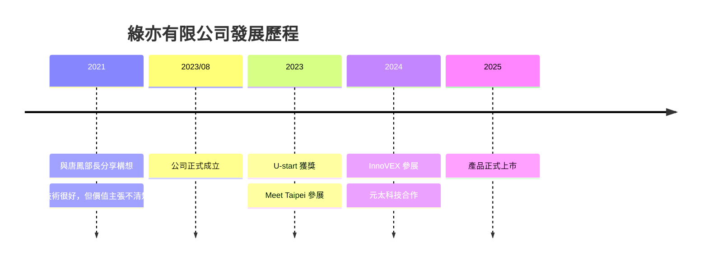

# 體察人心，善用

## 綠色科技創業的行銷實戰課

<div class="pt-12">
  <span class="px-2 py-1 rounded cursor-pointer" hover="bg-white bg-opacity-10">
    賴弘翌 Fred Lai ｜ 綠亦有限公司 創辦人
  </span>
</div>

---
layout: center
class: text-center
---

# 🤔 開場問題

<div class="text-3xl mt-8">

「你有沒有遇過這種情況？」

</div>

<v-clicks>

<div class="text-2xl mt-8 opacity-80">

技術很強，但客戶聽不懂你在講什麼

</div>

<div class="text-2xl mt-4 opacity-80">

產品很好，但不知道賣給誰

</div>

<div class="text-2xl mt-4 opacity-80">

理念很棒，但轉換不成訂單

</div>

</v-clicks>

---

# 我也曾經這樣

<v-clicks>

### 2021 年
跟唐鳳部長講了 30 分鐘綠藻技術...
她聽完說：「所以對企業的好處是什麼？」

### 2023 年第一次參展
攤位上放滿技術規格表
路過的人看一眼就走了

### 轉折點
一個客戶問我：「這個可以寫進 ESG 報告嗎？」
我才發現：**客戶要的不是技術，是解決方案**

</v-clicks>

---
layout: two-cols
---

# 關於我

<v-clicks>

- 🎓 台科大建築所博士班
- 🏛️ 成大建築系 / 建築所
- 🌿 美國 LEED AP BD+C 認證師
- 🏆 2023 U-start 獲獎團隊
- 💼 綠亦有限公司 創辦人

</v-clicks>

::right::

<div class="ml-4">

## 今天分享的核心

<v-click>

> 「體察人心，善用科技」

</v-click>

<v-click>

技術是手段
人心是目的
行銷是翻譯

</v-click>

</div>

---
layout: intro
---

# 今天的旅程 🗺️

<v-clicks>

### Part 1: 實戰經驗 (50 min)
從 0 到參展獲獎的真實旅程
🛠️ 小練習：一句話描述你的產品效益

### Part 2: 永續→銷售 (50 min)
把「環保理念」變成「客戶 KPI」
🛠️ 小練習：找出你產品的「可量化價值」

### Part 3: 市場定位 + 實作 (80 min)
STP 框架 + 逆向演繹法工作坊
🛠️ 完整練習：品牌故事撰寫

</v-clicks>

---
layout: section
---

# Part 1
## 實戰經驗：從 0 到參展獲獎

---
layout: center
class: text-center
---

# 🌿 先認識我們在做什麼

<div class="text-2xl mt-4">
  綠亦有限公司 ｜ 室內綠藻淨氣減碳系統
</div>

<div class="grid grid-cols-3 gap-8 mt-12">
  <div>
    <div class="text-4xl">🌬️</div>
    <div class="mt-2">空氣淨化</div>
    <div class="text-sm opacity-60">過濾 PM2.5</div>
  </div>
  <div>
    <div class="text-4xl">🌱</div>
    <div class="mt-2">減碳造氧</div>
    <div class="text-sm opacity-60">CO₂ → O₂</div>
  </div>
  <div>
    <div class="text-4xl">📊</div>
    <div class="mt-2">數據監控</div>
    <div class="text-sm opacity-60">IoT 即時追蹤</div>
  </div>
</div>

---

# 我們的里程碑



---

# 參展的真實收穫

<div class="grid grid-cols-2 gap-8">

<div>

### 😅 踩過的坑

<v-clicks>

- 攤位太小，產品放不下
- 名片發完了，聯絡方式沒留
- 技術講太深，客戶聽不懂
- 沒有準備不同長度的 pitch
- **最慘：花 3 天準備，收到 0 張有效名片**

</v-clicks>

</div>

<div>

### 💪 學到的事

<v-clicks>

- 準備 30 秒 / 3 分鐘 / 10 分鐘版本
- **收集名片比發名片重要**
- 用「效益」開場，不是「技術」
- 展後 48 小時內必須跟進
- **問題比答案更能建立連結**

</v-clicks>

</div>

</div>

---

# Pitch 的三個版本

<v-clicks>

### 30 秒版（電梯 pitch）
> 「我們用綠藻技術幫企業減碳，而且可以量化寫進 ESG 報告。」

### 3 分鐘版（攤位介紹）
> 「企業現在都有 ESG 壓力，但室內減碳很難量化。我們的綠藻淨氣機不只淨化空氣，還能即時監控 CO₂ 吸收量，讓你的永續報告有真實數據支撐。目前已經跟元太科技合作，也拿到 U-start 獎項。」

### 10 分鐘版（深度對談）
> 包含技術原理、商業模式、團隊背景、成功案例...

</v-clicks>

<v-click>

### 💡 關鍵洞察
**先講「對方關心的」，再講「你想說的」**

</v-click>

---

# 從失敗到成功的轉折

<div class="grid grid-cols-2 gap-8">

<div class="p-4 bg-red-500 bg-opacity-10 rounded">

### ❌ 失敗版本

「我們的綠藻生物反應器採用專利微藻株，CO₂ 吸收效率提高 300%，配合 HEPA 過濾和 IoT 監控系統...」

**結果：** 客戶眼神渙散

</div>

<div class="p-4 bg-green-500 bg-opacity-10 rounded">

### ✅ 成功版本

「你們公司有在寫 ESG 報告嗎？室內減碳那塊是不是很難量化？我們可以幫你解決這個問題，而且有即時數據。」

**結果：** 客戶主動問更多

</div>

</div>

<v-click>

### 差別在哪？
- 失敗版：我有什麼 → 你要不要
- 成功版：你有什麼痛 → 我怎麼解決

</v-click>

---
layout: center
class: text-center
---

# 🛠️ Part 1 練習時間

## 一句話描述你的產品效益

<div class="mt-8 text-left max-w-xl mx-auto">

### 模板：
> 「我們幫 [目標客戶] 解決 [具體痛點]，
> 讓他們可以 [獲得的好處]。」

### 範例：
> 「我們幫需要寫 ESG 報告的企業解決室內減碳難以量化的問題，
> 讓他們的永續報告有真實數據支撐。」

**時間：5 分鐘**
**方式：寫下來 → 跟旁邊的人分享 → 收集反饋**

</div>

---
layout: section
---

# Part 2
## 永續→銷售：把理念變成訂單

---

# 永續 ≠ 道德勸說

<v-clicks>

### ❌ 常見的失敗訴求
「為了地球，請買我們的產品」
「這是環保的選擇」
「支持永續發展」

### 🤔 客戶的真實想法
「很棒，但跟我的 KPI 有什麼關係？」
「老闆不會因為『環保』批准預算」
「我需要可以量化的成效」

</v-clicks>

<v-click>

### 💡 核心問題
**永續是「為什麼做」，不是「為什麼買」**

</v-click>

---

# 翻譯永續語言

把「環保特色」翻譯成「商業價值」：

| 永續特色 | ❌ 環保語言 | ✅ 商業語言 |
|----------|-------------|-------------|
| 綠藻吸收 CO₂ | 為地球減碳 | ESG 報告可量化數據 |
| HEPA 淨化空氣 | 呼吸更健康 | 員工病假減少 → 成本下降 |
| IoT 監控 | 智慧化管理 | 即時儀表板 → 向董事會展示 |
| 訂閱制維護 | 永續服務 | 不用擔心折舊 → 費用化處理 |

<v-click>

### 翻譯公式
**[環保特色] → [對客戶的具體好處] → [可量化的指標]**

</v-click>

---

# 找到「決策者的 KPI」

<v-clicks>

### 問自己：誰批准這筆預算？

**如果是 HR 主管：**
- 關心：員工健康、辦公環境、人才留任
- 語言：「改善空氣品質 → 員工滿意度提升」

**如果是永續長 (CSO)：**
- 關心：ESG 評分、碳盤查、永續報告
- 語言：「可量化減碳數據 → 直接寫進報告」

**如果是財務長 (CFO)：**
- 關心：ROI、成本效益、稅務優惠
- 語言：「訂閱制費用化 → 不影響資產負債表」

</v-clicks>

<v-click>

### 關鍵洞察
**同一個產品，對不同決策者說不同的話**

</v-click>

---

# 品牌故事三段式結構

<v-clicks>

### 1️⃣ 時空背景 + 品牌承諾
> 在 2050 淨零碳排的全球趨勢下，室內減碳成為企業的新挑戰。
> 綠亦承諾：**讓每一口呼吸都能被量化、被證明。**

### 2️⃣ 品牌核心 + 權威基礎
> 我們結合生物科技（綠藻）、建築專業（LEED 認證）、數據技術（IoT）
> 打造三位一體的減碳解決方案。

### 3️⃣ 創辦初衷 + 消費者印象
> 創辦人來自建築背景，深信好空氣不該只是感覺，而是可以被證明的事實。
> 客戶說：「終於有數據可以放進永續報告了。」

</v-clicks>

---

# 案例：從「環保」到「成交」

<div class="grid grid-cols-2 gap-4">

<div>

### 客戶背景
- 某科技公司 HR
- 正在改善辦公環境
- 有永續預算但不知怎麼用

### 原本的對話
HR：「你們產品有什麼特色？」
我：「我們用綠藻吸收 CO₂...」
HR：「聽起來很環保，我再考慮」

**結果：無下文**

</div>

<div>

### 轉變後的對話
我：「你們辦公室有量過 CO₂ 濃度嗎？」
HR：「沒有耶，為什麼問？」
我：「CO₂ 超過 1000ppm 會影響專注力，你們有注意到下午開會大家都昏昏沉沉的嗎？」
HR：「對耶！所以你們可以解決這個？」
我：「而且數據可以寫進 ESG 報告」
HR：「這個我老闆會有興趣」

**結果：約到老闆 demo**

</div>

</div>

---
layout: center
class: text-center
---

# 🛠️ Part 2 練習時間

## 找出你產品的「可量化價值」

<div class="mt-8 text-left max-w-xl mx-auto">

### 步驟：
1. 列出你產品的 3 個特色
2. 每個特色翻譯成「客戶好處」
3. 每個好處找出「可量化指標」

### 表格：
| 特色 | 客戶好處 | 量化指標 |
|------|----------|----------|
| [特色1] | [好處] | [指標] |
| [特色2] | [好處] | [指標] |
| [特色3] | [好處] | [指標] |

**時間：10 分鐘**

</div>

---
layout: section
---

# Part 3
## 市場定位 + 逆向演繹法工作坊

---

# STP 2.0：加入生命階段與情境

<div class="grid grid-cols-2 gap-8">

<div>

### 傳統 STP 的問題

<v-clicks>

- 「25-40 歲女性小資族」
- 這群人需求一樣嗎？
- 單身 vs 新手媽媽 = 完全不同
- 主管級 vs 小資族 = 預算差很多

</v-clicks>

</div>

<div>

### 新 STP 框架

<v-clicks>

**S - Stage of Life 生命階段**
需求在進入/離開某階段時最急迫

**S - Situation 情境**
讓「需求」成功變成「轉換」

**T - Targeting 目標市場**
前提：有需求 + 可負擔

**P - Positioning 定位**
在目標市場心中塑造獨特形象

</v-clicks>

</div>

</div>

---

# STP 實戰：綠亦案例

| 階段 | 傳統思維 | 我們的做法 |
|------|----------|------------|
| **S 區隔** | 按產業分類 | 按「生命階段」：**正在申請綠建築認證的企業** |
| **S 情境** | — | 年度 ESG 報告截止前 2 個月 |
| **T 目標** | 所有需要空氣清淨的人 | ESG 壓力大 + 預算可負擔的 B2B |
| **P 定位** | 「好用的空氣清淨機」 | 「**可量化減碳數據的綠色解決方案**」 |

<v-click>

### 💡 關鍵洞察
**「正在申請綠建築認證」= 急迫性最高的生命階段**
這時候他們最願意花錢解決問題

</v-click>

---

# 逆向演繹法是什麼？

<v-clicks>

### 從「誇張結果」反推「合理情境」

**範例：腋下白到發光**

```
誇張結果：腋下白到發光
↓
什麼情況會露出腋下？→ 健身、伸懶腰、叫車、掛在樹上
↓
為什麼掛在樹上？→ 救貓、摘果子、演雜技、被炸飛
↓
為什麼被炸飛？→ 煤氣爆炸
↓
為什麼煤氣爆炸？→ 明火
↓
為什麼產生明火？→ 電蚊拍
```

### 🎬 最終創意：用電蚊拍引發連鎖反應的搞笑廣告

</v-clicks>

---

# 綠亦的逆向演繹示範

```
誇張效果：辦公室空氣好到員工不想下班
↓
什麼情境會讓人不想離開？→ 森林、高山、海邊、氧氣吧
↓
為什麼辦公室像森林？→ 有植物、有新鮮空氣、有綠意
↓
為什麼有新鮮空氣？→ 有東西在製造氧氣
↓
為什麼在室內製造氧氣？→ 不能開窗（空污）+ 不能放太多植物（維護成本）
↓
什麼能製造氧氣又好維護？→ 綠藻淨氣機
```

<v-click>

### 🎬 創意方向
**短影片概念：「員工加班不是因為老闆，是因為空氣太好」**

</v-click>

---
layout: center
---

# 🛠️ Part 3 完整工作坊

## 逆向演繹法 + 品牌故事撰寫

<div class="mt-8 text-left">

### 階段一：逆向演繹（20 分鐘）
1. 寫下你產品的「誇張效果」
2. 反推 5 層「為什麼」
3. 找出創意情境

### 階段二：品牌故事（20 分鐘）
用三段式結構撰寫品牌故事

### 階段三：小組分享（20 分鐘）
- 每組 3 分鐘分享
- 其他組給予反饋
- 投票最佳創意

</div>

---

# 逆向演繹工作表

<div class="text-left">

```
誇張效果：[你的產品讓客戶___到___]

↓

什麼情境會發生？→ _______________

↓

為什麼會這樣？→ _______________

↓

為什麼___？→ _______________

↓

為什麼___？→ _______________

↓

為什麼___？→ _______________


🎬 創意方向：_________________
```

</div>

---

# 品牌故事工作表

<div class="text-left">

### 1️⃣ 時空背景 + 品牌承諾
> 在___的時代/趨勢下，___成為___的挑戰。
> [品牌名]承諾：___。

<div class="my-4 border-t border-gray-300"></div>

### 2️⃣ 品牌核心 + 權威基礎
> 我們結合___、___、___，
> 打造___的解決方案。

<div class="my-4 border-t border-gray-300"></div>

### 3️⃣ 創辦初衷 + 消費者印象
> 我們相信：___。
> 客戶說：「___。」

</div>

---
layout: center
class: text-center
---

# 今日金句

<div class="text-5xl font-bold mt-8">

「體察人心，善用科技」

</div>

<div class="mt-12 text-xl opacity-80 max-w-2xl mx-auto">

技術是手段，人心是目的

先理解客戶的痛點和 KPI

再用科技提供可量化的解決方案

**行銷不是說服，是翻譯**

</div>

---

# 課程回顧

<div class="grid grid-cols-3 gap-4">

<div class="p-4 bg-green-500 bg-opacity-20 rounded">

### Part 1 實戰經驗
- Pitch 三版本（30秒/3分/10分）
- 收集名片比發名片重要
- 用「效益」開場
- 🛠️ 一句話描述產品效益

</div>

<div class="p-4 bg-blue-500 bg-opacity-20 rounded">

### Part 2 永續→銷售
- 翻譯永續語言
- 找決策者的 KPI
- 品牌故事三段式
- 🛠️ 找出可量化價值

</div>

<div class="p-4 bg-purple-500 bg-opacity-20 rounded">

### Part 3 市場定位
- STP 2.0（生命階段+情境）
- 逆向演繹法
- 🛠️ 完整品牌故事撰寫

</div>

</div>

---
layout: center
class: text-center
---

# 謝謝聆聽！

<div class="mt-8">

### 聯絡資訊

🌐 [andgreen.vzy.io](https://andgreen.vzy.io)

📍 台北市中正區忠孝西路一段72號2樓之5

</div>

<div class="mt-8 opacity-60">

有任何問題歡迎交流！

歡迎 LinkedIn 連結 🤝

</div>

---
layout: end
---

# Q&A 時間
