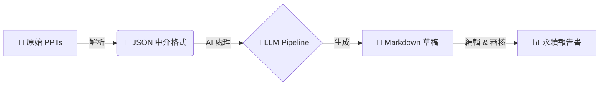

# 輔仁大學永續報告書製作系統介紹

給永續發展暨校務研究中心同事的技術分享

  2026-01-13

---
layout: center
class: text-center
---

# Part 1: 問題與挑戰
## (Problems & Challenges)

---

## 原本的痛點：資料散落與格式混亂

<v-clicks>

- 📚 **來源繁雜**：每年需處理來自各處室約 **58 份** 期末管考 PPT 簡報
- 🔄 **人工彙整耗時**：
  - 格式不統一（字體、版面、圖表風格迥異）
  - 數據散落在不同投影片，難以提取結構化資料
  - 缺乏統一的敘事邏輯，需大量人工潤飾
- 📉 **難以追蹤**：
  - 數據來源不可考
  - 修改歷程無法回溯
  - 漂綠風險（Greenwashing）難以控管

</v-clicks>

---
layout: center
class: text-center
---

# Part 2: 解決方案架構
## (Solution Architecture)

---

## 自動化管線：從 PPT 到 Markdown

將非結構化的 PPT 轉換為標準化的永續報告書草稿

  

    
🎯 目標

    
支援 17 個學院/單位的批次處理，大幅縮短彙整時間

  

  

    
⚡ 效益

    
統一格式、自動提取數據、標準化語氣

  

---

## 四階段處理流程 (Pipeline Stages)

我們採用了先進的 Agentic Workflow 設計：

  
1. Intent Decomposition

  
意圖分解

  
將複雜的報告需求拆解為獨立的撰寫任務

  
2. Tool Retrieval

  
工具檢索

  
根據任務需求，自動選取適合的數據提取工具

  
3. Prompt Generation

  
提示詞生成

  
動態組裝上下文，生成高品質的 LLM 指令

  
4. Config Assembly

  
配置組裝

  
整合所有參數，驅動生成最終內容

---
layout: center
class: text-center
---

# Part 3: 雲端編輯器
## (Cloud Editor)

---

## Flask Editor 架構與功能亮點

專為永續報告書設計的協作平台

### 🚀 核心功能
- **即時 Markdown 編輯**：所見即所得，支援實時預覽
- **智慧驗證系統**：
  - 自動比對原始數據
  - 漂綠關鍵字檢測 (Greenwashing Detection)
- **評分機制**：
  - 數據準確性 (Accuracy)
  - 可追溯性 (Traceability)
  - 語調客觀性 (Objectivity)

### 📝 追蹤修訂 (Track Changes)
類似 Word 的審閱模式，讓 AI 成為助手而非黑箱：

- ✅ 採納 (Accept)：確認 AI 修改正確
- ❌ 拒絕 (Reject)：保留原始版本
- 每一處修改都有**Diff View**對照，確保改動透明

---

## 編輯器介面展示 (Demo)

  

    
🖥️

    
Live Editor Interface

    
左側編輯 Markdown / 右側即時預覽與評分面板

  

---
layout: center
class: text-center
---

# Part 4: 驗證與評分系統
## (Validation & Scoring)

---

## 三大評分維度

系統會針對每一段落進行自動評分，確保報告品質

| 維度 | 英文指標 | 說明 |
| --- | --- | --- |
| **數據準確性** | Data Accuracy | 數字是否與原始 PPT 一致？單位是否正確？ |
| **事實可追溯性** | Fact Traceability | 每個聲明是否有明確的來源佐證？ |
| **語調客觀性** | Tone Objectivity | 是否使用了誇大、行銷式的用語（如「完美」、「世界第一」）？ |

  ⚠️ 自動偵測問題類型：
  數字錯誤、實體缺失（漏掉重要單位）、誇大用語、邏輯矛盾

---
layout: center
class: text-center
---

# Part 5: v4.0 未來規劃
## (Roadmap)

---

## 架構升級：打造數位孿生體驗

### 🖥️ Sidebar 雙分頁設計
左側導航欄將進化為雙模式：
1. **分析模式 (Analysis Mode)**：查看各學院的數據統計、進度概覽
2. **編輯模式 (Edit Mode)**：專注於文本修訂與排版

### 🔄 數位孿生 (Digital Twin)
- **即時反饋**：邊改邊看分數變化
- **動態模擬**：修改某個數據後，自動計算對整體永續指標的影響

---

## 多院版本比對 (Side-by-side Diff View)

針對 17 個單位的大量資料，提供高效率的比對工具：

```mermaid
graph TD
    A[原始 PPT 內容]
    B[AI 初步修訂版]
    C[人工核可版]

    A -.->|Diff 1| B
    B -.->|Diff 2| C

    style A fill:#333,stroke:#fff
    style B fill:#444,stroke:#aaf
    style C fill:#252,stroke:#afa
```

- **三欄對照**：原始資料 vs AI 生成 vs 最終定稿
- **版本控制**：完整記錄每一次決策過程

---

## InDesign 出版串接 (IDML Integration)

打通從「編輯」到「出版」的最後一哩路

- **IDML 匯出**：
  - 支援 Adobe InDesign 交換格式 (IDML)
  - 系統內容直接轉為排版軟體可讀格式
- **樣式對照表 (Style Mapping)**：
  - Markdown H1 → InDesign "章節標題"
  - Markdown Quote → InDesign "重點引言"

### 📅 三階段開發時程
1. **Phase 1 融合與復活**：整合舊版圖表與歷史數據
2. **Phase 2 多院版本比對**：強化批次審閱功能
3. **Phase 3 出版串接**：IDML 自動化輸出

---
layout: center
class: text-center
---

# Part 6: 總結
## (Summary)

---

## 下一步行動

從 **手工彙整** 到 **AI 輔助自動化**
 
我們不只是在寫報告，而是在建立**永續資料的數位資產**

  

    
🤖

    
自動化

    
減少 80% 重複勞動

  

  

    
⚖️

    
標準化

    
統一語調與格式

  

  

    
🚀

    
智慧化

    
數據驅動決策

  

---
layout: end
---

# 謝謝聆聽
## Q & A
