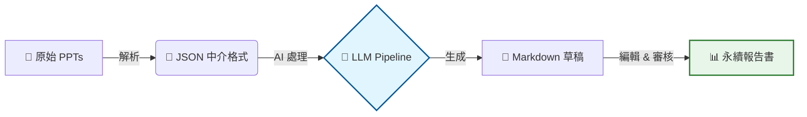

# 輔仁大學永續報告書製作系統介紹

給永續發展暨校務研究中心同事的技術分享

  2026-01-13
  v4.0.0

---
layout: statement
---

# 一個關於「複製貼上」的惡夢...

  <v-click>
  想像一下，現在是 12 月底的最後一個工作週。
  </v-click>
  <v-click>
  你的信箱裡躺著 <b>58 封</b> 來自不同處室的郵件，每封都夾帶著一份格式完全不同的 PPT。
  </v-click>
  <v-click>
  "這張圖太糊了"、"那個單位的數據單位是錯的"、"為什麼這一頁用了 Comic Sans 字體？"
  </v-click>
   
  <v-click>
  而你的任務，是在一週內將它們變成一份<b>國際標準的永續報告書</b>。
  這就是我們過去每一年面臨的真實挑戰。
  </v-click>

---
layout: section
---

# Part 1: 問題與挑戰
## (Problems & Challenges)

---
layout: two-cols
---

## 原本的痛點：資料散落與格式混亂

<v-clicks>

- 📚 **來源繁雜**
  - 每年需處理約 **58 份** 期末管考 PPT
  - 來自 17 個不同學院與行政單位
- 🔄 **人工彙整耗時**
  - 格式不統一（字體、版面、圖表風格迥異）
  - 數據散落在投影片角落，難以提取
  - 缺乏統一敘事邏輯，需大量人工潤飾
- 📉 **難以追蹤**
  - 數據來源不可考
  - 修改歷程無法回溯
  - 漂綠風險（Greenwashing）難以控管

</v-clicks>

::right::

  

    
😫

    
58 份 PPT

    
x 30 頁/份

    

    
= 1,740 頁

    
人工審閱地獄

  

---
layout: section
---

# Part 2: 解決方案架構
## (Solution Architecture)

---

## 自動化管線：從 PPT 到 Markdown

將非結構化的 PPT 轉換為標準化的永續報告書草稿

  <v-click>
    

      
🎯 目標

      
支援 17 個學院/單位的批次處理，大幅縮短彙整時間

    

  </v-click>
  <v-click>
    

      
⚡ 效益

      
統一格式、自動提取數據、標準化語氣

    

  </v-click>

---

## 四階段處理流程 (Pipeline Stages)

我們採用了先進的 Agentic Workflow 設計：

<v-click>

  
1. Intent Decomposition

  
意圖分解

  
將複雜的報告需求拆解為獨立的撰寫任務

</v-click>

<v-click>

  
2. Tool Retrieval

  
工具檢索

  
根據任務需求，自動選取適合的數據提取工具

</v-click>

<v-click>

  
3. Prompt Generation

  
提示詞生成

  
動態組裝上下文，生成高品質的 LLM 指令

</v-click>

<v-click>

  
4. Config Assembly

  
配置組裝

  
整合所有參數，驅動生成最終內容

</v-click>

---
layout: section
---

# Part 3: 雲端編輯器
## (Cloud Editor)

---
layout: two-cols
---

## Flask Editor 架構與功能亮點

專為永續報告書設計的協作平台

### 🚀 核心功能

<v-clicks>

- **即時 Markdown 編輯**
  - 所見即所得，支援實時預覽
- **智慧驗證系統**
  - 自動比對原始數據
  - 漂綠關鍵字檢測 (Greenwashing Detection)
- **評分機制**
  - 數據準確性 (Accuracy)
  - 可追溯性 (Traceability)
  - 語調客觀性 (Objectivity)

</v-clicks>

::right::

### 📝 追蹤修訂 (Track Changes)

  
// 類似 Word 的審閱模式

   
  

    ✅ 採納 (Accept)
    確認 AI 修改正確
  

  

    ❌ 拒絕 (Reject)
    保留原始版本
  

  

    Diff View 確保改動透明化
  

---

## 編輯器介面展示 (Demo)

  

    
🖥️

    
Live Editor Interface

    
左側編輯 Markdown / 右側即時預覽與評分面板

    
【截圖待補充】

  

---
layout: section
---

# Part 4: 驗證與評分系統
## (Validation & Scoring)

---

## 三大評分維度

系統會針對每一段落進行自動評分，確保報告品質

<table class="w-full border-collapse">
  <thead>
    <tr class="bg-gray-100/10 text-left">
      <th class="p-3 border-b border-gray-600">維度</th>
      <th class="p-3 border-b border-gray-600">英文指標</th>
      <th class="p-3 border-b border-gray-600">說明</th>
    </tr>
  </thead>
  <tbody>
    <tr>
      <td class="p-3 border-b border-gray-700 font-bold text-blue-300">數據準確性</td>
      <td class="p-3 border-b border-gray-700 font-mono text-sm">Data Accuracy</td>
      <td class="p-3 border-b border-gray-700">數字是否與原始 PPT 一致？單位是否正確？</td>
    </tr>
    <tr>
      <td class="p-3 border-b border-gray-700 font-bold text-green-300">事實可追溯性</td>
      <td class="p-3 border-b border-gray-700 font-mono text-sm">Fact Traceability</td>
      <td class="p-3 border-b border-gray-700">每個聲明是否有明確的來源佐證？</td>
    </tr>
    <tr>
      <td class="p-3 border-b border-gray-700 font-bold text-yellow-300">語調客觀性</td>
      <td class="p-3 border-b border-gray-700 font-mono text-sm">Tone Objectivity</td>
      <td class="p-3 border-b border-gray-700">是否使用了誇大、行銷式的用語？</td>
    </tr>
  </tbody>
</table>

<v-click>

  
⚠️

  

    自動偵測問題類型：
    數字錯誤、實體缺失（漏掉重要單位）、誇大用語（如「完美」、「世界第一」）、邏輯矛盾
  

</v-click>

---
layout: center
class: text-center
---

# 🧠 練習時間 (Interactive Session)

請找出下列句子中的「潛在問題」：

  "本學院今年度推動了<b>無數場</b>環保講座，參與人數<b>爆滿</b>， 
  成效達到<b>世界級水準</b>，完全落實永續精神。"

<v-click>
  

    

      
❌ "無數場"

      
數據模糊，缺乏具體量化指標

    

    

      
❌ "爆滿"

      
主觀形容詞，應提供具體人數

    

    

      
❌ "世界級水準"

      
誇大行銷用語 (Marketing Fluff)

    

  

</v-click>

---
layout: section
---

# Part 5: v4.0 未來規劃
## (Roadmap)

---
layout: two-cols
---

## 架構升級：打造數位孿生體驗

### 🖥️ Sidebar 雙分頁設計
左側導航欄將進化為雙模式：

<v-clicks>

1. **分析模式 (Analysis Mode)**
   - 查看各學院的數據統計
   - 進度概覽 Dashboard
2. **編輯模式 (Edit Mode)**
   - 專注於文本修訂
   - 傳統的 Markdown 編輯體驗

</v-clicks>

::right::

### 🔄 數位孿生 (Digital Twin)

  <v-click>
  

    
⚡ 即時反饋

    
邊改邊看分數變化，寫作就像玩遊戲

  

  </v-click>

  <v-click>
  

    
📊 動態模擬

    
修改某個數據後，自動計算對整體永續指標(SDGs)的影響

  

  </v-click>

---

## 多院版本比對 (Side-by-side Diff View)

針對 17 個單位的大量資料，提供高效率的比對工具：

```mermaid
graph TD
    A[原始 PPT 內容]
    B[AI 初步修訂版]
    C[人工核可版]

    A -.->|Diff 1| B
    B -.->|Diff 2| C

    style A fill:#333,stroke:#fff
    style B fill:#444,stroke:#aaf
    style C fill:#252,stroke:#afa
```

<v-clicks>

- **三欄對照**：原始資料 vs AI 生成 vs 最終定稿
- **版本控制**：完整記錄每一次決策過程 (Git-like History)
- **批次審閱**：一鍵套用相同類型的修改建議

</v-clicks>

---

## InDesign 出版串接 (IDML Integration)

打通從「編輯」到「出版」的最後一哩路

  <h3 class="text-xl font-bold mb-4 text-pink-400">功能亮點</h3>
  <ul class="list-disc pl-5 space-y-2">
    <v-click><li><b>IDML 匯出</b>：支援 Adobe InDesign 交換格式</li></v-click>
    <v-click><li><b>樣式對照表</b> (Style Mapping)：
      <ul class="list-circle pl-5 mt-1 text-sm opacity-70">
        <li>Markdown H1 → InDesign "章節標題"</li>
        <li>Markdown Quote → InDesign "重點引言"</li>
      </ul>
    </li></v-click>
  </ul>

  <h3 class="text-xl font-bold mb-4 text-pink-400">開發時程</h3>
  

    <v-click>
    

      
1

      Phase 1 融合與復活
    

    </v-click>
    <v-click>
    

      
2

      Phase 2 多院版本比對 Doing
    

    </v-click>
    <v-click>
    

      
3

      Phase 3 出版串接
    

    </v-click>
  

---
layout: statement
---

# Part 6: 總結
## (Summary)

---

## 下一步行動

從 手工彙整 到 AI 輔助自動化
 
我們不只是在寫報告，而是在建立**永續資料的數位資產**

  <v-click>
  

    
🤖

    
自動化

    
減少 80% 重複勞動

  

  </v-click>

  <v-click>
  

    
⚖️

    
標準化

    
統一語調與格式

  

  </v-click>

  <v-click>
  

    
🚀

    
智慧化

    
數據驅動決策

  

  </v-click>

---

# 簡報索引 (Q&A 快速導航)

### Part 1 問題與挑戰
- [#3 開場故事](/3)
- [#5 痛點分析](/5)

### Part 2 解決方案架構
- [#7 自動化管線](/7)
- [#8 四階段流程](/8)

### Part 3 雲端編輯器
- [#10 Flask Editor](/10)
- [#11 編輯器展示](/11)

### Part 4 驗證與評分
- [#13 三大評分維度](/13)
- [#14 練習時間](/14)

### Part 5 未來規劃
- [#16 數位孿生](/16)
- [#17 版本比對](/17)
- [#18 IDML 串接](/18)

### Part 6 總結
- [#20 下一步行動](/20)

  按 G 鍵可輸入頁碼快速跳轉 ｜ 按 O 鍵開啟總覽模式

---
layout: center
class: text-center
---

# 謝謝聆聽
## Q & A

  

    Q1: 系統如何處理舊版 PPT?
  

  

     Q2: AI 驗證的準確率如何?
  

  

     Q3: 是否支援其他部門擴充?
  

  

     Q4: 導入系統的技術門檻?
  

