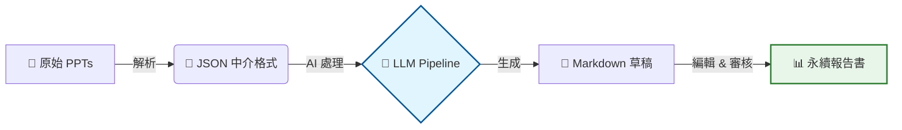

# 輔仁大學永續報告書製作系統介紹

給永續發展暨校務研究中心同事的技術分享

  
    開始探索 <carbon:arrow-right class="inline ml-1"/>
  

  2026-01-13
  v4.0.0

---
layout: statement
---

# 💬 一個關於「複製貼上」的惡夢...

  <v-click>
  

    
📅

    想像一下，現在是 12 月底的最後一個工作週。
  

  </v-click>

  <v-click>
  

    
📧

    你的信箱裡躺著 <b>58 封</b> 來自不同處室的郵件，每封都夾帶著一份格式完全不同的 PPT。
  

  </v-click>

  <v-click>
  

    <carbon:warning class="text-3xl text-yellow-400 mt-1 flex-shrink-0" />
    "這張圖太糊了"、"那個單位的數據單位是錯的"、"為什麼這一頁用了 Comic Sans 字體？"
  

  </v-click>

  <v-click>
  

    而你的任務，是在一週內將它們變成一份<b>國際標準的永續報告書</b>。
    這就是我們過去每一年面臨的真實挑戰。
  

  </v-click>

---
transition: fade-out
---

# 📚 課程導航

  <v-click>
  

    
1

    

      
問題與挑戰

      
Problems & Challenges

    

  

  </v-click>

  <v-click>
  

    
2

    

      
解決方案架構

      
Solution Architecture

    

  

  </v-click>

  <v-click>
  

    
3

    

      
雲端編輯器

      
Cloud Editor

    

  

  </v-click>

  <v-click>
  

    
4

    

      
驗證與評分系統

      
Validation & Scoring

    

  

  </v-click>

  <v-click>
  

    
5

    

      
v4.0 未來規劃

      
Roadmap

    

  

  </v-click>

  <v-click>
  

    
6

    

      
總結與 Q&A

      
Summary

    

  

  </v-click>

---
layout: section
---

# Part 1
## 問題與挑戰
### ⚠️ 突破傳統報告彙整的瓶頸

---

# 🤔 傳統報告製作的痛點

  

    
📚

    

      <h3 class="text-xl font-bold text-red-400">來源繁雜</h3>
      
每年需處理約 <b>58 份</b> 期末管考 PPT，來自 17 個不同學院與行政單位。

    

  

  

    
🔄

    

      <h3 class="text-xl font-bold text-red-400">人工彙整耗時</h3>
      
格式不統一（字體、版面迥異），數據散落難以提取，需大量人工潤飾。

    

  

  

    
📉

    

      <h3 class="text-xl font-bold text-red-400">難以追蹤</h3>
      
數據來源不可考，修改歷程無法回溯。

    

  

  

    
⚠️

    

      <h3 class="text-xl font-bold text-red-400">漂綠風險</h3>
      
Greenwashing 難以控管，誇大用語容易出現。

    

  

---

# 💡 Paradigm Shift：從「手動」到「AI 輔助」

  <h3 class="text-center mb-4 font-bold text-gray-400 flex items-center justify-center gap-2">
    ❌ 傳統方式 (Manual)
  </h3>
  

    1. 收集 58 份 PPT 
    2. 逐一開啟、複製數據 
    3. 貼入 Word 文檔 
    4. 手動校對格式... 
    5. 重複 N 次
  

  
"每一步都需要人工判斷"

  <h3 class="text-center mb-4 font-bold text-blue-400 flex items-center justify-center gap-2">
    <carbon:checkmark-outline class="text-green-400" /> AI 輔助 (Automated)
  </h3>
  

    1. PPT 批次匯入 
    2. AI 自動提取數據 
    3. AI 生成草稿 
    4. 人工審核修訂 
    5. 一鍵輸出報告
  

  
"讓 AI 處理重複工作，人專注審核"

  我們的目標：減少 80% 的重複性勞動，同時提升報告品質

---
layout: section
---

# Part 2
## 解決方案架構
### 🔧 自動化管線設計

---

# 🏗️ 系統架構圖

  <v-click>
    

      

        🎯 目標
      

      
支援 17 個學院/單位的批次處理，大幅縮短彙整時間

    

  </v-click>
  <v-click>
    

      

        ⚡ 效益
      

      
統一格式、自動提取數據、標準化語氣

    

  </v-click>

---

# 🔧 四階段處理流程 (Agentic Workflow)

<v-click>

  
1️⃣

  

    <h4 class="font-bold text-blue-400">Intent Decomposition</h4>
    
將複雜的報告需求拆解為獨立的撰寫任務

  

</v-click>

<v-click>

  
2️⃣

  

    <h4 class="font-bold text-green-400">Tool Retrieval</h4>
    
根據任務需求，自動選取適合的數據提取工具

  

</v-click>

<v-click>

  
3️⃣

  

    <h4 class="font-bold text-yellow-400">Prompt Generation</h4>
    
動態組裝上下文，生成高品質的 LLM 指令

  

</v-click>

<v-click>

  
4️⃣

  

    <h4 class="font-bold text-red-400">Config Assembly</h4>
    
整合所有參數，驅動生成最終內容

  

</v-click>

---
layout: section
---

# Part 3
## 雲端編輯器
### ✏️ 專為永續報告設計的協作平台

---
layout: two-cols
---

# 🌐 Flask Editor

專為永續報告書設計的協作平台

### 核心功能

<v-clicks>

- **即時 Markdown 編輯**
  - 所見即所得，支援實時預覽
- **智慧驗證系統**
  - 自動比對原始數據
  - 漂綠關鍵字檢測
- **評分機制**
  - 數據準確性 (Accuracy)
  - 可追溯性 (Traceability)
  - 語調客觀性 (Objectivity)

</v-clicks>

::right::

### 📝 追蹤修訂 (Track Changes)

  
// 類似 Word 的審閱模式

   
  

    ✅ 採納 (Accept)
    確認 AI 修改正確
  

  

    ❌ 拒絕 (Reject)
    保留原始版本
  

  

    🔍 Diff View 確保改動透明化
  

---
layout: section
---

# Part 4
## 驗證與評分系統
### 📊 確保報告品質與可信度

---

# 📊 三大評分維度

<table class="w-full border-collapse">
  <thead>
    <tr class="bg-gray-100/10 text-left">
      <th class="p-3 border-b border-gray-600">維度</th>
      <th class="p-3 border-b border-gray-600">英文指標</th>
      <th class="p-3 border-b border-gray-600">說明</th>
    </tr>
  </thead>
  <tbody>
    <tr>
      <td class="p-3 border-b border-gray-700 font-bold text-blue-300">
        ✓ 數據準確性
      </td>
      <td class="p-3 border-b border-gray-700 font-mono text-sm">Data Accuracy</td>
      <td class="p-3 border-b border-gray-700">數字是否與原始 PPT 一致？單位是否正確？</td>
    </tr>
    <tr>
      <td class="p-3 border-b border-gray-700 font-bold text-green-300">
        🔗 事實可追溯性
      </td>
      <td class="p-3 border-b border-gray-700 font-mono text-sm">Fact Traceability</td>
      <td class="p-3 border-b border-gray-700">每個聲明是否有明確的來源佐證？</td>
    </tr>
    <tr>
      <td class="p-3 border-b border-gray-700 font-bold text-yellow-300">
        ⚖️ 語調客觀性
      </td>
      <td class="p-3 border-b border-gray-700 font-mono text-sm">Tone Objectivity</td>
      <td class="p-3 border-b border-gray-700">是否使用了誇大、行銷式的用語？</td>
    </tr>
  </tbody>
</table>

<v-click>

  <carbon:warning class="text-2xl text-yellow-400 flex-shrink-0" />
  

    自動偵測問題類型：
    數字錯誤、實體缺失、誇大用語（如「完美」、「世界第一」）、邏輯矛盾
  

</v-click>

---
layout: center
class: text-center
---

# 🧠 練習時間 (Interactive Session)

請找出下列句子中的「潛在問題」：

  "本學院今年度推動了<b>無數場</b>環保講座，參與人數<b>爆滿</b>， 
  成效達到<b>世界級水準</b>，完全落實永續精神。"

<v-click>
  

    

      

        ❌ "無數場"
      

      
數據模糊，缺乏具體量化指標

    

    

      

        ❌ "爆滿"
      

      
主觀形容詞，應提供具體人數

    

    

      

        ❌ "世界級水準"
      

      
誇大行銷用語 (Marketing Fluff)

    

  

</v-click>

---
layout: section
---

# Part 5
## v4.0 未來規劃
### 🚀 Roadmap

---
layout: two-cols
---

# 🖥️ 架構升級

### Sidebar 雙分頁設計

<v-clicks>

1. **分析模式 (Analysis Mode)**
   - 查看各學院的數據統計
   - 進度概覽 Dashboard
2. **編輯模式 (Edit Mode)**
   - 專注於文本修訂
   - 傳統的 Markdown 編輯體驗

</v-clicks>

::right::

### 🔄 數位孿生 (Digital Twin)

  <v-click>
  

    

      ⚡ 即時反饋
    

    
邊改邊看分數變化，寫作就像玩遊戲

  

  </v-click>

  <v-click>
  

    

      📈 動態模擬
    

    
修改數據後，自動計算對 SDGs 的影響

  

  </v-click>

---

# 📊 開發時程 (Roadmap)

```mermaid
graph TD
    A[原始 PPT 內容]
    B[AI 初步修訂版]
    C[人工核可版]

    A -.->|Diff 1| B
    B -.->|Diff 2| C

    style A fill:#333,stroke:#fff
    style B fill:#444,stroke:#aaf
    style C fill:#252,stroke:#afa
```

  <v-click>
  

    
Phase 1

    
融合與復活

    
✅ 已完成

  

  </v-click>

  <v-click>
  

    
Phase 2

    
多院版本比對

    
進行中

  

  </v-click>

  <v-click>
  

    
Phase 3

    
IDML 出版串接

    
即將開始

  

  </v-click>

---
layout: statement
---

# Part 6
## 總結
### <carbon:checkmark-outline class="inline" /> Summary

---

# 📈 成效總結

<v-click>

  
58

  
PPT 處理

</v-click>

<v-click>

  
17

  
單位覆蓋

</v-click>

<v-click>

  
80%

  
效率提升

</v-click>

<v-click>

  
✓

  
漂綠控管

</v-click>

  "從手工彙整到 AI 輔助，我們不只是在寫報告，而是在建立永續資料的數位資產。"

---

# 💎 核心價值

<v-click>

  
🤖

  

    <h4 class="font-bold text-blue-400">自動化</h4>
    
減少 80% 重複性勞動

  

</v-click>

<v-click>

  
⚖️

  

    <h4 class="font-bold text-green-400">標準化</h4>
    
統一格式與語調

  

</v-click>

<v-click>

  
🚀

  

    <h4 class="font-bold text-purple-400">智慧化</h4>
    
數據驅動決策

  

</v-click>

---

# 📑 簡報索引 (Q&A 快速導航)

### Part 1-3
- [#2 開場故事](/2)
- [#3 課程導航](/3)
- [#5 傳統痛點](/5)
- [#6 方案對比](/6)
- [#8 系統架構](/8)
- [#9 四階段流程](/9)

### Part 4-6
- [#12 三大評分維度](/12)
- [#13 練習時間](/13)
- [#15 數位孿生](/15)
- [#16 開發時程](/16)
- [#18 成效總結](/18)
- [#19 核心價值](/19)

  按 <kbd>G</kbd> 鍵可輸入頁碼快速跳轉 ｜ 按 <kbd>O</kbd> 鍵開啟總覽模式

---
layout: center
class: text-center
---

# 🙋 Q&A

永續報告書製作系統

  

    ❓ 系統如何處理舊版 PPT?
  

  

    ❓ AI 驗證的準確率如何?
  

  

    ❓ 是否支援其他部門擴充?
  

  

    ❓ 導入系統的技術門檻?
  

  
    Thank you for listening! ❤️
  

